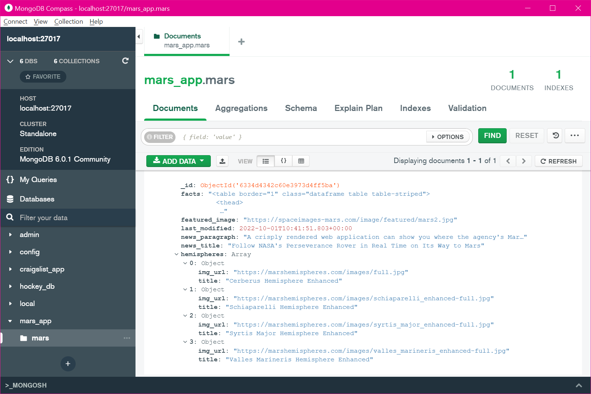
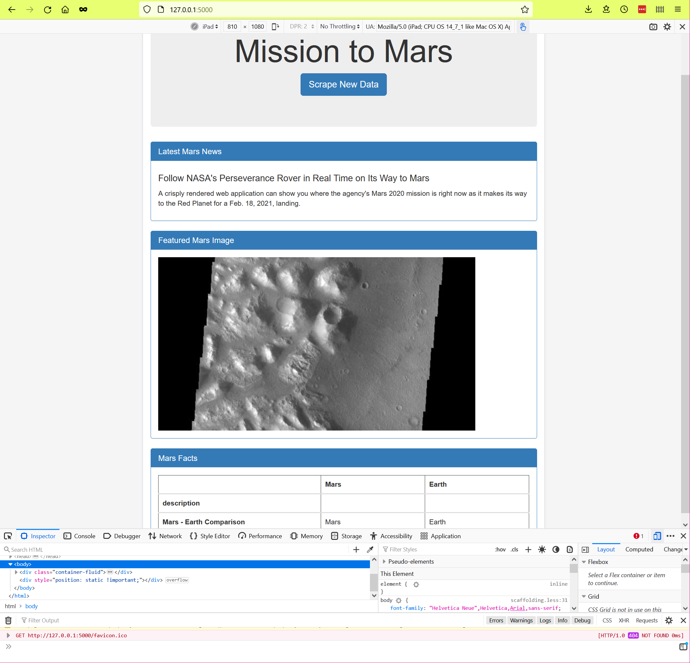
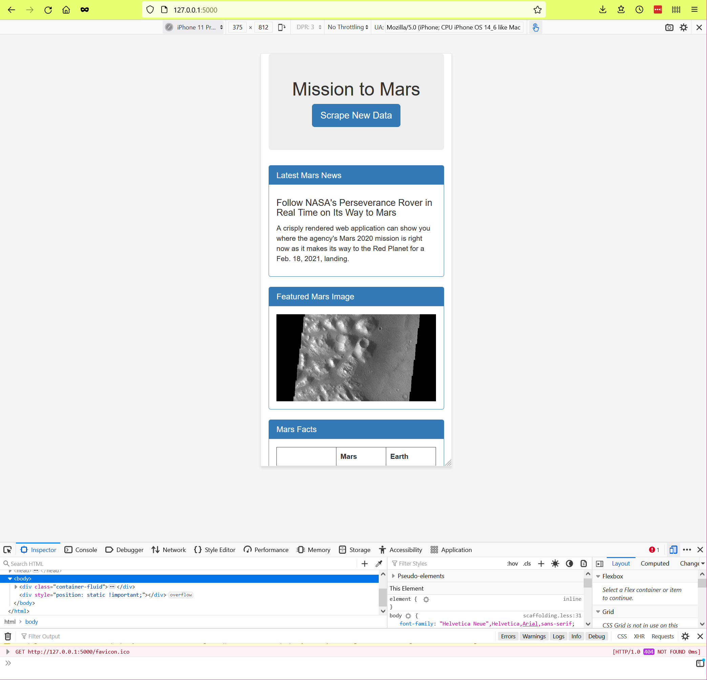
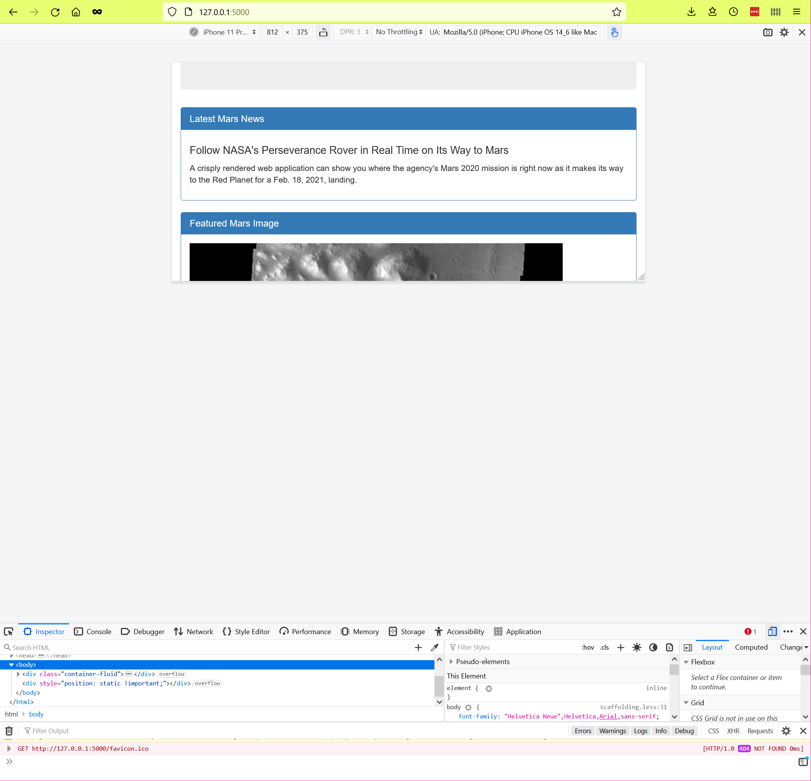

# Mission_to_Mars - Web Application

### Overview
This project developed a web application for collecting and presenting data about the planet Mars.

### Methodology
A Jupyter Notebook was created for development of the basic python code for web scraping multiple source websites.  The Jupyter Notebook was then exported to Python and refactored to include multiple functions.  A Flask application was written to present a website of the scraped data, and connect to a mongo database and display the stored data.

Here is a view of the mongo database with the stored information:

The Flask website contained a button to initiate a scrape of new data.

The Flask website contained Bootstrap 3 components, which were then customized to present a unique site.  The final html includes Bootstrap panels, which have been modified to have a blue background and border, with white header text.  The data table has been modified with a hover feature that highlights the desired row.

### Responsive Design
An additional goal of this project was to ensure that the Flask application was responsive to the viewing device.  The following images demonstrate the adaption of the site rendering for multiple devices in both vertical and horizontal orientations.

